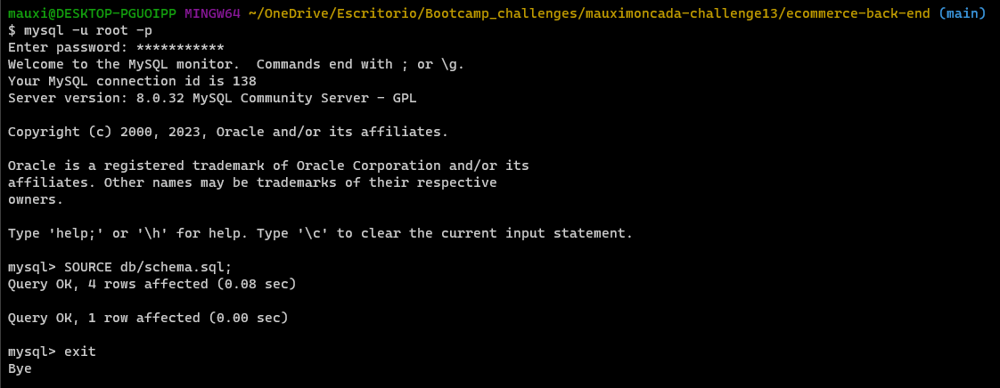
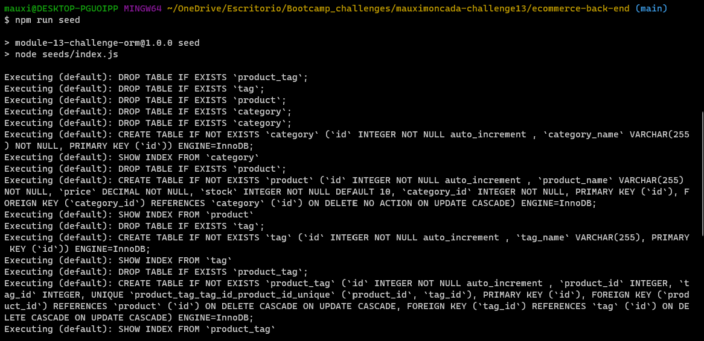
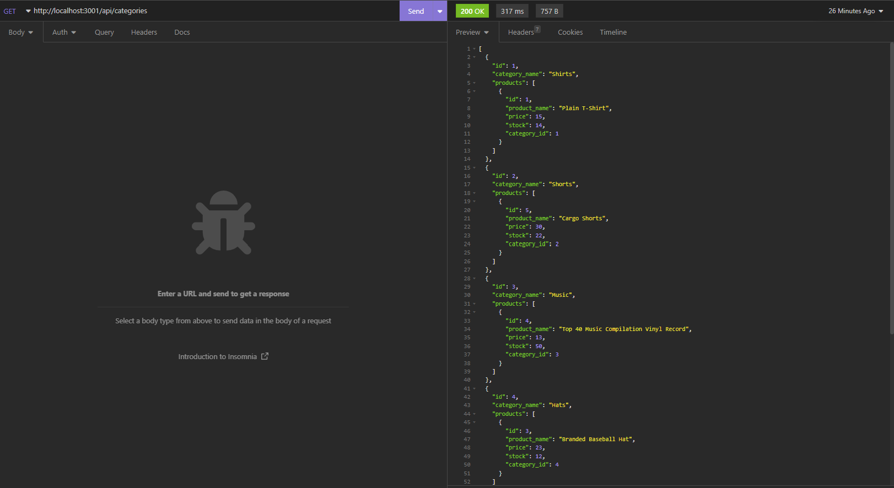

# ecommerce-back-end

## Description
Back end application of an e-commerce site databse.

-------------------

## Installation

* npm install

## Usage

Create your database by following the steps:
> mysql -u root -p

> SOURCE schema.sql

> EXIT

Populate the database with these commands:
> npm run seed

> npm start

------

## Application Documentation

[Click here to watch this application in action!]()

Github Repo: https://github.com/MoMoncada/ecommerce-back-end

---------------------

## Application Screenshots
---------------------

### Creating the database

### Populating the Table

### Insomnia

## Credits
Maria Auxiliadora Moncada 

------------

## License
N/A